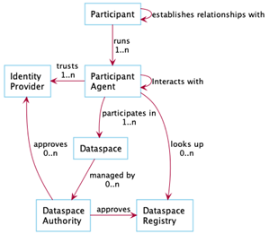
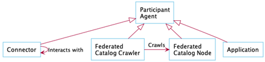
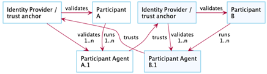
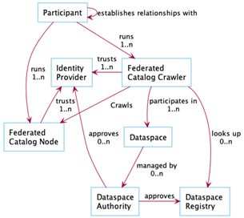
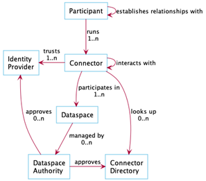
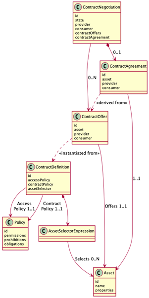
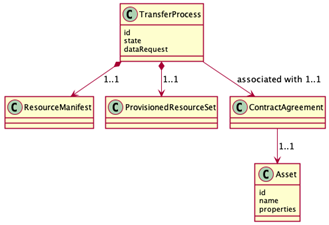

## Overview

This document provides an overview of a _context model_ for a dataspace. A context model provides a conceptual backdrop for the architecture and implementation of a software system. Since a context model organizes and informs a codebase, concepts it introduces may not necessarily translate directly into business terminology. For example, Kubernetes has the concepts of operators and controllers; those concepts may have no direct expression in the business terminology used to describe a service that is built on that infrastructure. However, it must be possible to map a business requirement to a context model. The concept model described in this document is implemented by the EDC.

## Dataspaces in a Nutshell

All dataspaces can be expressed by the following context model:

**Figure 1: The essentials of a dataspace**

Participant agents are software systems that perform a specific operation or role in a dataspace. The following illustrates the different types of participant agents that may exist in a dataspace:

**Figure 2: Participant Agent types**

The participant agent types are:

- **Federated Catalog Node:** A system that publishes _assets_ provided by a participant in a dataspace. Publishing makes the assets available for discovery. A participant may choose to make an asset available to a subset of other participants using an _access policy_ and impose usage requirements with an _usage policy._

- **Federated Catalog Crawler:** A system that discovers assets published by other participants in a dataspace. The result of a crawling operation is a collection of assets the crawling participant has access to. Access is determined by the provider participant and may include evaluation of access policy and usage policy against a set of verifiable credentials.

- **Connector** : A system that performs _contract negotiation_ and _asset sharing_ (data transfer or compute-to-data) on behalf of a participant.

- **Application:** A custom system that performs some role in the dataspace. For example, a supply-chain parts tracking service.

### Identity and Trust in a Dataspace

In _ **Figure 1** _ (above), the notion of a _Dataspace Authority_ was introduced. The Dataspace Authority is responsible for approving one or more identity providers that serve as trust anchors in a dataspace. The Dataspace Authority is an optional role; a dataspace may exist where there is no central authority or it is composed of autonomous actors with no centralized decision-making process.

There is, however, at least one _Identity Provider_ associated with a dataspace since all _participant agents_ are identifiable. This is an important distinction: while a participant has an identity, all participant agents also have a unique identity. Furthermore, the participant agent identity may be hierarchically related to the participant identity, thereby making it possible to establish a trust chains. Consider the following scenario, which underscores why this distinction is important. Company A may have two participant agents located in different geographic regions. Based on their location, one participant agent may access geospatially restricted data the other agent cannot access. Access policy would be determined using verifiable credentials tied to the participant agent identity.

An identity provider may be centralized, distributed, or a combination of the two:

**Figure 3: Identity and trust in a dataspace**

In a dataspace with one centralized identity provider, both Participant A and Participant B would share the same provider.

### Catalog Participant Agents

There are two types of _Catalog Participant Agent_: The Federated Catalog Node (FCN) and the Federated Catalog Crawler (FCC). The FCN is used to publish assets to a dataspace. The details of publishing are described in the following section on contract negotiation. It is important to note that the EDC-based FCN is not an asset repository in the classic sense. Rather, it is an index of assets and pointers to content stored in diverse systems such as object cloud storage, databases, and other infrastructure. The role of the FCN is to make that index available for discovery by other participants.

The FCC is a participant agent that queries (or crawls) other FCNs in a dataspace. It may be required to present verifiable credentials used to determine which assets are visible to it. A naïve implementation of an FCC could perform real-time crawling in response to a query made by an end-user. This would not scale for dataspaces of any significant size. The EDC FCC, in contrast, performs periodic crawling operations of other FCNs and updates a local, query-able cache. The following diagram illustrates the relationship between the FCC and FCN:

**Figure 4: The FCC and FCN in a dataspace**

### Connector Participant Agents

A Connector is a specialized participant agent that functions as the asset sharing infrastructure in a dataspace. Connectors may share diverse assets such as data streams, API access, big data, or compute-to-data services. They may support push data transfers, pull data transfers, event streaming, pub/sub notifications, or a variety of other transfer topologies. The following outlines the role of the connector in a dataspace:

**Figure 5: Connectors in a dataspace**

Asset sharing is performed in two distinct steps: _contract negotiation_ and _data transfer._ In the EDC, both contract negotiation and data transfer are implemented as asynchronous state machines. Processes transition through a series of states that are understood by the client and provider connectors. Some dataspaces may optimize the contract negotiation step by transitioning it automatically when an asset is requested. Other dataspaces (or, more precisely, participants) may implement a contract negotiation process backed by automated or human workflow. The role of the connector is to manage these processes and provide an audit history of all operations.

### Contract Negotiation

TBD

**Figure 6: Contract negotiation**

### Data Transfer

TBD

**Figure 7: Data transfer process**
