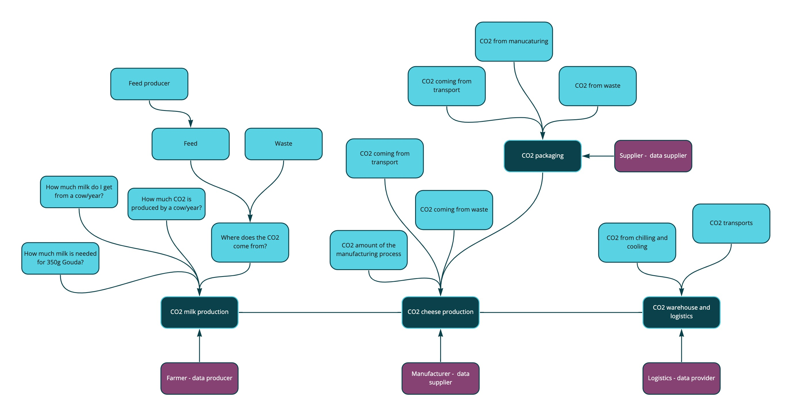
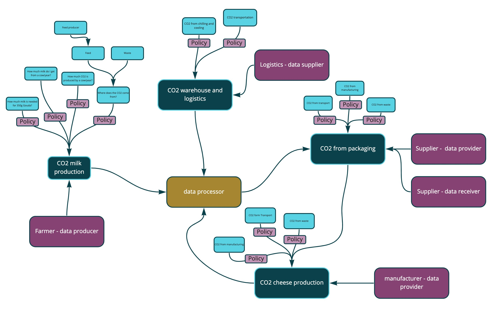
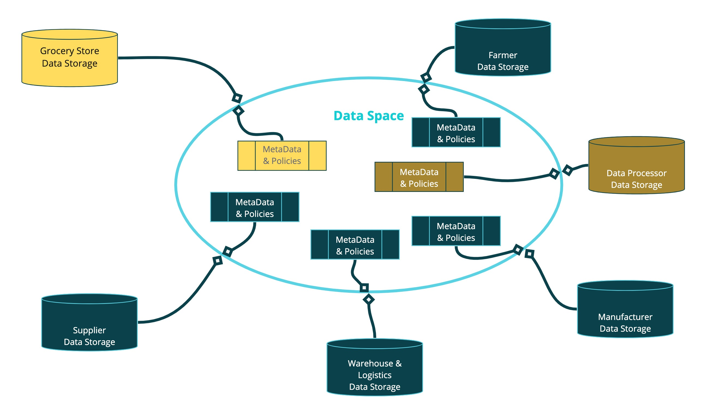
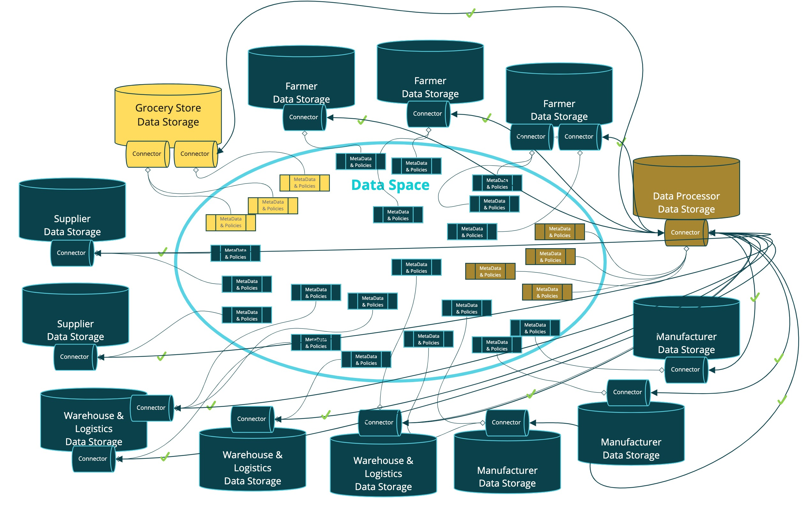

## A User Journey to Data Spaces

### As of Q2/2022

Purpose of the document:

This document aims to demonstrate the necessity and functions of data spaces.

# Table of contents

_**Abstract**_

_**Introduction**_

_**User Story – Part I**_

_**User Story – Part II**_

Authors:

Natascha Totzler ([natascha.totzler@gmail.com](mailto:natascha.totzler@gmail.com)) and

Günther Tschabuschnig ([guenther.tschabuschnig@gmail.com](mailto:guenther.tschabuschnig@gmail.com))

The present document was published under an [Apache 2.0 license](mailto:https://www.apache.org/licenses/LICENSE-2.0.html) and follows the rules of the Eclipse Foundation.

#

# Abstract

Every day, billions of new data are generated, measured and managed by the humankind: environment data, health data, social media data etc. 
 
When it comes to data use and data sharing, however, corporate entities quickly reach their limits. The presented example shows how organizations can actually benefit from these limits by creating new data-driven business cases.

Since our world is increasingly becoming data-driven, and we make products out of data, it is essential to also provide a corresponding technological environment. The related tools mentioned in this document, such as data spaces or connectors, are the building blocks that can be applied to create, use and participate in a data ecosystem. In this process, particularly high value is placed on topics of sovereignty, trust and interconnectedness of data.

In our example of building data spaces, we use a digital product passport (DPP) that illustrates the traceability of a supply chain by focusing on the subject of CO2. This example demonstrates how data-driven innovation and the building blocks of economy of data can promote product improvements or even new products.

&quot;_Without Data, you&#39;re just another person with an opinion.&quot;_

_- W. Edwards Deming_

# Introduction

A regional organic grocery store operator wants to raise consumer and supplier awareness of grocery carbon footprint. The goal is to encourage suppliers to produce and offer groceries that are more climate friendly and sustainable in the long term, as research suggests that consumers are more likely to purchase an item if they are provided information about its carbon footprint.

The product to be created is a data-based calculation of CO2 emissions of every individual food item, in the form of a badge that is placed on each product label of all private label products.

The organic grocery store operator has a wide range of food items. The product range mainly comprises basic food items and dairy products. As the intended project is very extensive, the company decides to run a proof of concept (POC) using the supply chain of one individual food item.

The generally popular Gouda cheese from organic farming is chosen for the proof of concept.

Alex, who is the responsible project manager, identifies all stakeholders and determines what is needed to calculate the carbon footprint of this food item. A first research delivers the following key parameters:

- CO2 emissions for the milk needed for a 350g package of Gouda cheese
- CO2 emissions of cheese production
- CO2 emissions for packaging
- CO2 emissions for warehouse and logistics to the grocery store

Since these parameters are not given figures but based on various calculations, the project manager visualizes which data sets are needed and from whom:

It quickly becomes apparent that this calculation, even if it is just for a single food item, involves many different data sources and data suppliers. Even if Alex collects all the necessary one-time data, she would still need help from external parties to do the calculation.

So she rolls up her sleeves, contacts her suppliers and gets everyone on board. Everybody is interested in principle in participating in the project and eager to see whether it is feasible at all, even if some of the partners are skeptical whether the data will only be used as agreed upon.

The organic farm and the organic cheese producer approve of transparency and awareness raising and, moreover, hope to achieve a long-term increase in purchase of their products due to better sales figures. The data savvy logistics partner is supportive of this goal, and also sees the potential to optimize logistics and reduce CO2 emissions (and costs) based on the collected data. After all, the data sharing does not have to be a one-way street in the long run.

While data suppliers are determining all the necessary figures, Alex is looking for an adequate data processor and data intermediary. (A data intermediary is an organization that processes data on behalf of another organization. A data intermediary works to manage data in a specific way and ensure a certain degree of trust with regard to the use of data.) What she needs is a service company which can prepare data from different sources for further processing, in terms of both content and quality, and also do the required calculations like aggregation, anonymization and analysis.

Since this is a proof of concept, and no established data exchange contracts are available an NDA is drafted and contractual agreements for sharing data in this project are arranged. Alex ensures that there is a digital storage location to save the data. Due to the uniqueness of the project, all stakeholders agree to save their data in the cloud storage run by the organic grocery store operator, where the data processing company can also access the data from the cloud storage.

All contracts are signed, the data is stored in the cloud storage of the organic grocery store operator and subsequently processed, and voila the Gouda cheese gets its first carbon footprint number.

To be able to use the successful proof of concept for management and marketing purposes, Alex turns to the graphics department, who develop the corresponding packing design, i.e. the future product labels.

The presentation of the label design is well received, and Alex gets the order to develop the design of carbon footprint labels for all private label products.

# User Story – Part I

Alex is now facing the challenge of getting all suppliers and supply-chain participants on board. However, the requirements are much higher this time than they were with the proof of concept because the complexity of the project has increased exponentially. This is due to the continuous data streams and a substantially greater number of participants in the future data-based product.

Alex identifies the following new requirements:

- First and foremost, there must be no manual steps required for this process because that would not be feasible. Among other things, this means that the values determined must be send automatically to the packaging producer so to print the calculated carbon footprint on the product labels. Therefore, the data stream must flow in both directions: to and from the data processor. If we think about this in the case of Gouda cheese, it would look like this:

- Besides that, the data suppliers also have a requirement that they must be able to define which data set may be shared, with whom (access policy), and under what conditions (usage policy). After all, they are dealing with confidential production data that can cause considerable damage in the wrong hands. If we think about this in the case of Gouda cheese, usage policies and access policies need to be included in multiple places:

- In addition, the exchange of data has to be automatic and only possible if specific conditions are fulfilled, i.e. only if the data recipient has accepted the policies of the data provider.

- Unfortunately, in our case all of this cannot be yet fully automated due to the way the data was collected in the first place, i.e. by uploading them to the data drive of the organic grocery store operator. At the time of delivery of data to the cloud storage of the organic grocery store operator, the respective data supplier had no way of controlling whether the data will be used only for the agreed purpose, or who could view or access the data in the cloud storage. However, every data supplier wants to ensure that they can leverage control and make an explicit decision as to who may receive, view or process their data (data autonomy issue). For the data supplier to be able to do so, conditions of data exchange must be clearly defined and negotiated before sending the data, as well as continuously monitored and recorded during the exchange of data.

For the proof of concept, however, data was delivered directly to the cloud storage of the organic grocery store operator. This procedure was acceptable for everyone in this case, since all the parties agreed thereto, it was a small and clearly defined circle of participants, the one-time data transfer was not business-critical and there was a general mutual trust among the participating parties. This resulted in the following picture:

In order to create a data-based product, such as a carbon footprint label for every packaged product, as well as to produce carbon footprint labels on a large scale for all private label products of the organic grocery store with participants who do not know each other, a completely different type of architecture and data transfer is necessary: a digital room in which business partners can find each other, access data descriptions (=metadata) and agree on conditions for data exchange (=policies) before any actual data exchange takes place. The mentioned digital room is known as a data space:

Participants in a data space can access all shared data descriptions (metadata), but not yet the contents of data files! This is comparable to a book cover providing the title, the author and a short description (= metadata), and a price tag stating the conditions for access to the contents (= usage and access policies). In our example, the metadata set could be titled &quot;Milk production per cow per year&quot;, provided by &quot;farmer XY&quot;, offered under the usage condition (usage policy) that &quot;data my only be stored in the EU&quot; and access condition (access policy) &quot;for members of the organic grocery stores club&quot;. If an interested party complies with these conditions, the technological basis is established to enable the data transfer (i.e. connectors exchange data between the two partners).

If we look at this on a superficial technological level, it means that the participants keep their respective data and data sources and only grant other participants access to the respective metadata and policies. Only after the policies are complied with, the data transfer takes place by means of connectors. A connector is thus a technical building block that is linked to a data source on one side of the exchange and can connect with other connectors under the defined conditions on the other side. These connectors are not merely adapters; they also ensure that the policies are being complied with. For example, a connector can carry the information that the data source linked to it is located in the EU; otherwise, it is not possible to agree to the policies which govern the data transfer, and no data transfer can take place. (Data Exchange Service)

**Summary:**

The need for data spaces quickly becomes apparent when it comes to sharing data in a trusted environment with partners outside of your own organization. Our increasingly data-driven world creates products from data, therefore it is essential to also create a suitable technological environment. Neutral, decentralized digital spaces (data spaces) are not controlled by one of the parties but instead provide a fair, cooperative playing field for all participants, enabling them to exchange metadata and agree on access and usage policies. From a technological point of view, connectors form the basis for such a data exchange.
 
  
   

# User Story – Part II

Alex managed to bring together all the suppliers of food items in the private label product line. The resulting map is very remarkable for this use case alone! Numerous suppliers and logistics partners deliver data under their own terms and conditions, and with the aim to calculate the carbon footprint of an item and provide it on the product packaging. Not only is data supplied from individual data sources, but it&#39;s also processed by a specialized company for the purpose of data analysis and then fed back so that the resulting values can be printed on each product label. Due to the large number of participants, manual administration of the data transfers is no longer feasible. Even a simplified picture clearly shows how many connections need to be established under the defined conditions:

Moreover, the project is not only successful within the organization. The implementation of such a data-based product, which increases transparency in terms of sustainability and involves so many different stakeholders, also attracts media attention. Various magazines, blogs and e-journals refer to the use case, and the topic is increasingly gaining momentum. Within the shortest time this is reflected in the sales figures, as the eco-conscious consumers of the organic grocery store appreciate the transparency.

The increased media attention and the rising sales lead to Alex receiving another project assignment from her superior. She is asked to &quot;... figure out what else can be done with the data. It all seems to work out quite well!&quot;

During the proof of concept, one of the logistics partners has implied that there&#39;s interest in a data-based route optimization.

Alex, the logistics partner and the data processing startup company set out to formulate another use case with the aim to not only measure CO2 emissions but to optimize them. The three parties agree to analyze data for the purpose of route optimization during a contract period of one year: on the basis of the continuously collected data, route planning shall be optimized, synergies with other suppliers created and progress measured. After the expiration of the contract period, the automated data transfers shall be discontinued, and the optimized carbon footprint shall be used as reference for further measures.

Stopping all data flows at the end of the agreed period does not pose a problem since the connectors ensure that data may only be transferred under the defined conditions at the technological level. In the case that a contract expires or a partner does not comply with one or several conditions, no data transfer takes place. This means that every data supplier has full control over their data transfers at all times, and that is also highly impressive to the Chief Data Officer and the legal department of the organic supermarket chain.

Connectors thus offer several advantages:

- Data transfers only take place when conditions defined by the data supplier are met and such conditions must be explicitly agreed to.
- These conditions are expressed through policies, which can be quite extensive to ensure that a data consumer is in fact eligible to access the data on the level of technology. For example, already at this level it can be defined that only members of a certain group may access the data (by using verifiable credentials).
- On the level of connectors, it can be ensured that the target connector uses a storage location which meets the requirements with regard to both its geographical location and available certificates. For example, if data may only be stored in the EU, then this is a policy which can be ensured at the level of connectors.
- Data transfers can be limited in several ways, for example &quot;one-time transfer only&quot; or &quot;continuous updates from the production company for the time period defined&quot;. No access to data is possible outside of the defined policies.

This technology and its use cases open many new possibilities for the participants and draw further public attention.

The project started with a simple proof of concept, and it led to a data-based product which creates transparency (a carbon footprint label for the entire range of products) and to the optimization of the actual CO2 emissions for the same products. Alex has not only created real added value for her organization, its customers and the environment, but also has attracted the interest of many other parties.

The focus of interest is now no longer the question how individual logistics partners can optimize their routes and minimize CO2 emissions, but the obvious next step is to map and optimize the entire supply chain down to the fertilizer suppliers and their subcontractors. In addition, due to the requirements of supply chain laws (supply chain due diligence), it must also be ensured that all partners meet the defined requirements and ethical standards and show a sufficient level of integrity. For this reason, additional service providers want to join the data space.

There are also other parties which have heard about the data space, and they are now striving to establish their own data space because counterfeit products constitute a serious problem and new data-driven technologies open new possibilities for them to address this issue.

In summary, it can be stated that these are the challenges most suited for data spaces:

- Many different parties want to generate added value by using data, be it for data-based products, services, process optimization or cost savings.
- Often these different parties have no trust relationship, they often do not know each other, or may even be competitors.
- Moreover, each of these parties must keep control over their own data flows at all times and know who can access their data and when.
- The parties also must know under which conditions their data can be accessed and used.

All of this can already be mapped and implemented with existing technologies, i.e. decentralized systems that are interconnected by means of connectors, cooperating in a data space to enable collaboration.

Data spaces are not limited to supply chains or individual use cases in the area of sustainability. Data spaces can combine whole domains such as mobility, health, energy, circular economy, or agriculture - no limits are set here. Data spaces can be driven by corporations, but also research or policies, or even be a combination of all of the above.

It is all about sovereignty, autonomy, trust and innovation in decentralized data ecosystems.

All of it, and much more, is already feasible with technology available today.

All we need to do is - do it!
