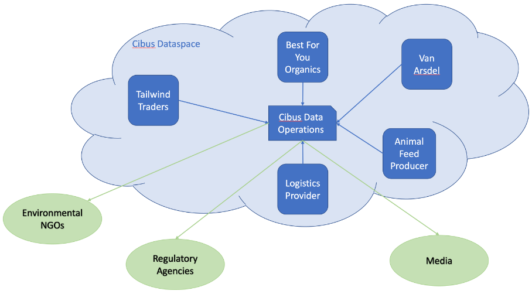

> Disclaimer: The example companies, organizations, products, domain names, e-mail addresses, logos, people, places, and events depicted herein are fictitious. No association with any real company, organization, product, domain name, e-mail address, logo, person, places, or events is intended or should be inferred.

# Introduction to User Story

Meet Francesca.

Francesca is the newly appointed Sustainability Program Manager at Italian _Fictitious Foods Company (FFC)_, a large food retailer. As such, her first and highest priority is to devise a system that enables _FFC_ to put a CO2 label on every item in the company's stores, so environmentally conscious customers can make informed purchasing decisions (as part of brand strategy as well as anticipated future regulatory requirements).

To do so, Francesca needs data. Lots of data. Most of _FFC’s_ suppliers will not be able to give her a per-item CO2 figure, so she will need data going all the way back to source materials. For example, to calculate the CO2 footprint for _FFC’s_ popular dry-aged beef prime rib, she will need

* The lifetime amount of water consumed by the cow
* The cow’s age
* The cow’s weight
* The weight of the piece of prime rib steak
* The lifetime amount of food consumed by the cow
* The type of food fed to the cow
* The annual energy usage of the rancher
* The energy mix used by the rancher
* The animal food supplier (its entire data to calculate the CO2 footprint of the feed)
* The entire logistics chain (its entire data to calculate the CO2 footprint of logistics)
* And so on…

The above data is, of course, by no means exhaustive. And that’s just for one store item!

“Where can I get all that data?” Francesca wonders. Looking for advice, she contacts André, a former colleague at French _Marvelous Organic Foods (MOF)_, another food retailer, only to find out that he too struggles with the same question.

“You know what? Let’s build a joint venture together.” Francesca proposes. “A non-profit that facilitates data exchange between food retail stores and chains and their suppliers, where everyone involved can exchange data in a controlled manner. Stores could get all the data they need for CO2 calculations – and maybe much more – and suppliers could, for example, get information on the turnover of their product to anticipate demand.”

After some discussions, the two companies decide to join forces and create the initiative _Cibus_ as a non-profit organization. As a first step, _Cibus_ hire an IT expert, who quickly realizes that this calls for the creation of a dataspace.

Francesca and André approach some of the suppliers both _FFC_ and _MOF_ have relationships with to convince one of them to engage in a pilot project. Paul, CEO of _SuperCows_, a Tirolean organic cattle rancher, decides to participate and becomes a member of _Cibus_.

During initial discussions, more and more potential members for _Cibus_ become obvious, such as the logistics companies who transport not only finished products for _FFC_ and _MOF_, but also the animal feed from various suppliers to _SuperCows_. Also, regulatory agencies might need access to the CO2 (and other) data, non-profit organizations in the environmental protection arena might be able to use data from _Cibus_ directly to certify specific standards adhered to by its members, and even media outlets might want to access data for public reporting. Which would mean that _Cibus_ itself become an active participant in the dataspace to – as a collective good for its members – collate, process, and provide data to members as well as external agencies.

To make all these potential future scenarios possible, the members of _Cibus_ decide on some basic requirements for their dataspace.

# Basic Requirements

As _FFC_ and _MOF_ have different infrastructural environments (_MOF_ run everything in their own data center, while _FFC_ are in a hybrid environment with some legacy applications running on-premises, and the rest on the cloud), not to mention _SuperCows_ and all the other environments of their suppliers, it is clear from the outset that the solution must be infrastructure-agnostic.

Security is a big concern to all involved. After all, they each plan to divulge to each other more data than they have ever done before. And they want to do so in an automated, reliable, auditable way. A big part of security is knowing who you are sharing data with and trusting that the entity you are connecting with really is who they claim to be. Therefore, identification, and certification and verification of identity, will be paramount.

While Francesca is aware that the pilot with _SuperCows_ will initially be of limited scope, she wants to plan ahead for a dataspace where numerous participants can join in, each with their own data on offer, and with their own need for data from the other participants. This means that there will be the need for some sort of catalog, where participants in the space can look up not only who is participating, but also what sort of data all those participants have on offer, and with what policies attached. While this could be a central database that each participant publishes their data on offer to, _Cibus’s_ IT expert argues that this could soon become complicated to manage, a single attack vector from a security perspective, and slow to search. Also, he believes that participants might not want all other participants to even see the same data on offer from them. He advocates for some form of federated catalog, where each participant only sees the data that other participants want to offer that particular partner.

Paul reveals that his animal feed suppliers are (currently) unwilling to participate directly in the dataspace. He proposes that he contract an external vendor who act as a data processor: they get data from the animal feed suppliers and from _SuperCows_, calculate the corresponding CO2 figure per kilogram of livestock, and then supply that data to the members of _Cibus_ without revealing the exact CO2 figures for the feedstock. However, in the future, the animal feed suppliers must be able to join _Cibus_ and exchange data directly with participants while still enforcing their strict data usage policies.

After some discussion, they collectively decide on the following high-level requirements for their dataspace:

* The dataspace must be infrastructure-agnostic. No matter on what environment each participant in the space runs, all should be able to join.
* There must be some sort of digital identity management. This would ideally be decentralized and based on trusted certification from one or many third-party certification providers. Each participant must be able to independently verify the identity of all other participants.
* There must be a decentralized catalog where all participants can look up all data offered specifically to them by other participants in the space.
* There must be some way of making sure that contractually defined usage policies for shared data is enforced automatically.
